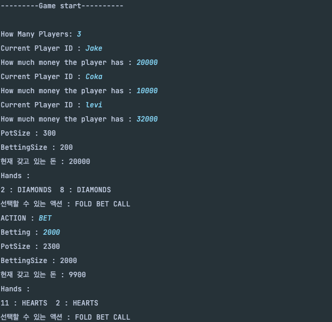

# Poker with spring boot

## description
    you can play texas holdem with CLI.
    you should modify METHOD variable as CLI in env.properties to play in CLI.
    
    Backend process is not yet ready.

    you can execute like this!
    
    

    
## distribute
    You can distribute to this app. Just PR with description of your code.
